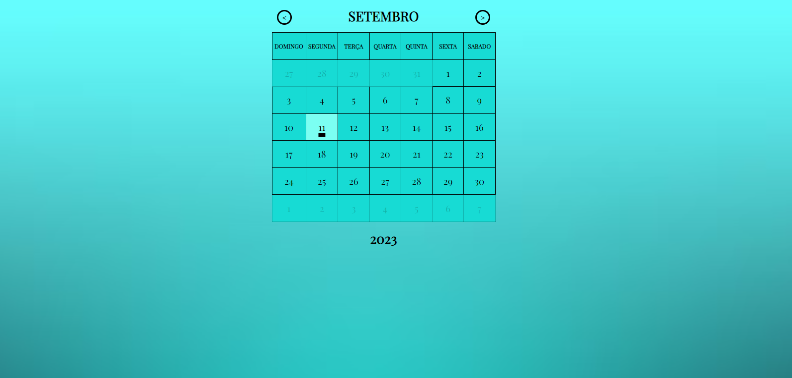

# Calendário Dinâmico

Este é um projeto de calendário dinâmico criado utilizando HTML, CSS e JavaScript. Ele permite a navegação entre os meses e anos, exibindo os dias correspondentes de forma interativa.

## Como Utilizar

1. Baixe ou clone o repositório em seu computador.

2. Abra o arquivo `index.html` em seu navegador web.

3. O calendário será exibido, permitindo a navegação entre os meses e anos.

4. Para mudar o mês ou ano, utilize os botões de navegação.

## Funcionalidades

- Navegação dinâmica entre os meses e anos.
- Destaque do dia atual.
- Visualização clara e intuitiva dos dias da semana.

## Sobre o Projeto

Este projeto foi criado para demonstrar o uso um pouco mais avançado de HTML, CSS e JavaScript na criação de um calendário dinâmico. Ele oferece uma experiência interativa para os usuários, permitindo que explorem diferentes meses e anos de forma fácil.

### Tecnologias Utilizadas

- HTML
- CSS
- JavaScript

## Licença

Este projeto está licenciado sob a [Licença MIT](LICENSE).
