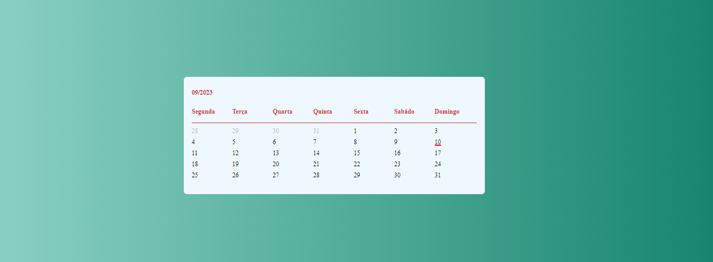

# Calendário Estático - Setembro de 2023

Este é um projeto de calendário básico criado utilizando HTML, CSS e JavaScript. Ele exibe apenas os dias do mês de setembro de 2023, destacando a data atual com uma pequena marcação.

## Como Utilizar

1. Baixe ou clone o repositório em seu computador.

2. Abra o arquivo `index.html` em seu navegador web.

3. O calendário será exibido, mostrando os dias do mês de setembro de 2023. A data atual será marcada de forma distintiva.

## Sobre o Projeto

Este projeto foi criado com o propósito de demonstrar o uso básico de HTML, CSS e JavaScript na criação de um calendário estático. Ele serve como um exemplo simples de implementação de uma interface de calendário.

### Tecnologias Utilizadas

- HTML
- CSS
- JavaScript

## Licença

Este projeto está licenciado sob a [Licença MIT](LICENSE).
