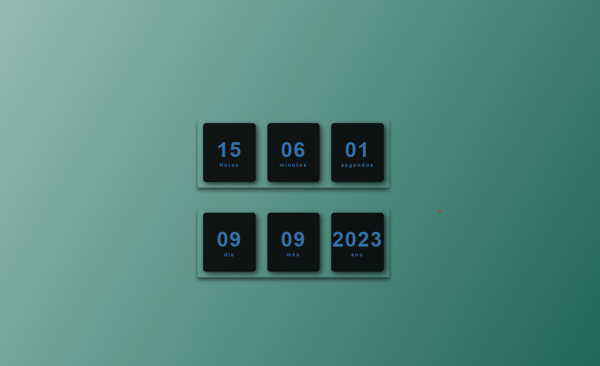
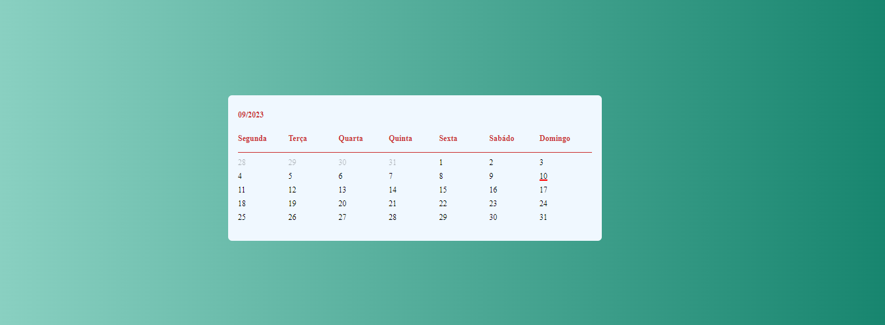
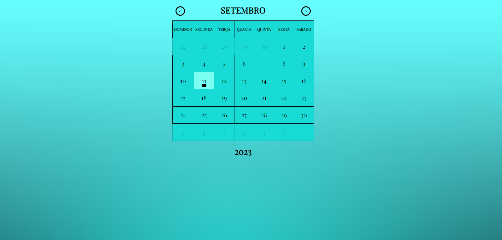
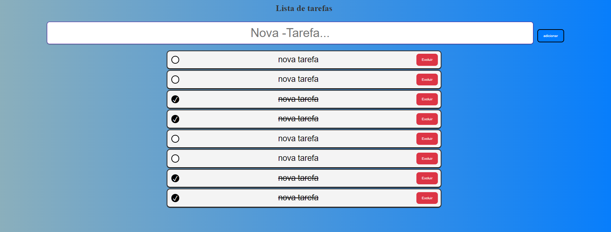

# Projetos Básicos: HTML, CSS e JavaScript

Este repositório contém uma coleção de projetos simples desenvolvidos com HTML, CSS e JavaScript. Cada pasta representa um projeto independente nele também é mostrado um readme com imagens, demonstrando conceitos fundamentais de desenvolvimento web.

## Projetos Incluídos

1. **Relógio digital e data**
   - 
   - Este é um projeto de um relógio digital simples desenvolvido com HTML, CSS e JavaScript. Ele exibe a hora atual em um formato de 24 horas e exibe Também a data atual.

2. **Calendário Estático - Setembro de 2023**
   - 
   - Este é um projeto de calendário básico criado utilizando HTML, CSS e JavaScript. Ele exibe apenas os dias do mês de setembro de 2023, destacando a data atual com uma pequena marcação.

3. **Calendário Dinâmico**
   - 
   - Este é um projeto de calendário dinâmico criado utilizando HTML, CSS e JavaScript. Ele permite a navegação entre os meses e anos, exibindo os dias correspondentes de forma interativa.

4. **to-do-list**
   - 
   - .Um simples aplicativo de lista de tarefas interativa criado com HTML, CSS e JavaScript. Permite aos usuários adicionar, marcar como concluídas e excluir tarefas de forma eficiente.
5. **galeria de filmes**
   - uma simples galeria de filmes para demostrar conceitos js e css principalmente
   - 
6. **conversor de moedas**
   - um simples conversor de moedas padronizado com as taxas do dia 18/11/23 projeto basico para praticar css e js principalmente.
   - 

7. **Cronometro Pomodoro**
   - simples cronometro que altera entre o tempo de trabalho e o tempo de descanso sozinho para melhor aproveitamento do tempo, aviso sonoro ao encerar um ciclo de tempo. um projetoo basico para praticar html css e javascript.
    - 
8. **Formulário com Gerador de senha**
   - O objetivo deste projeto é proporcionar uma prática de desenvolvimento web utilizando tecnologias fundamentais (HTML, CSS e JavaScript) na construção de um formulário de cadastro responsivo. A inclusão do gerador de sugestão de senha busca demonstrar a interação entre o usuário e a geração de senhas seguras.
   - 
9. **calculadora**
   - uma simples cauculadora com operações basicas. objetivo treinar js e css em sua maioria
   - 
10. **Gerador de QR code**
   - Este é um projeto simples de gerador de QR Code desenvolvido em HTML, CSS e JavaScript, que oferece uma maneira fácil e rápida de criar códigos QR. O gerador utiliza a API do Google para garantir precisão na geração dos QR Codes.
   - 
## Como Usar

1. Clone ou baixe este repositório para o seu computador.
2. Navegue até a pasta do projeto que deseja explorar.
3. Abra o arquivo `index.html` em um navegador web.

## Contribuição

Se você gostaria de contribuir com mais projetos ou melhorias, sinta-se à vontade para criar um fork e enviar um pull request.