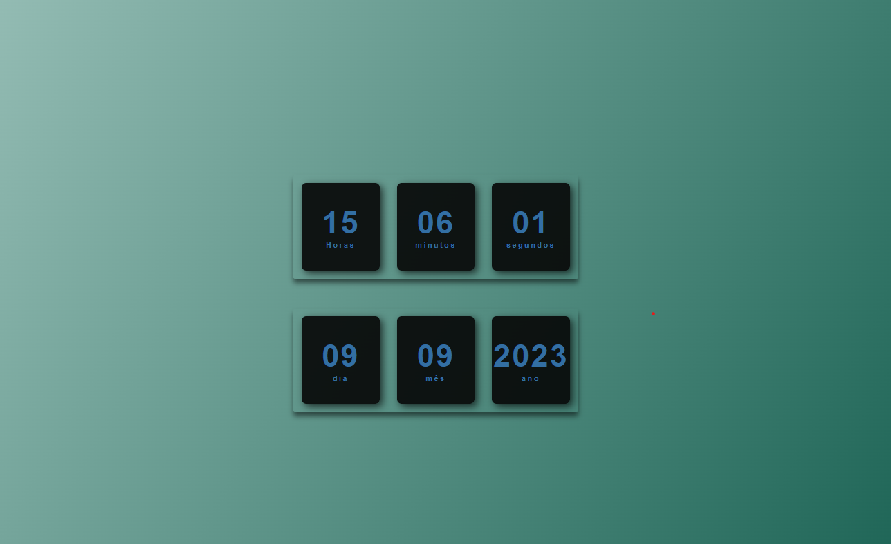

# Relógio e Relógio de Contagem Regressiva

Este é um projeto simples de um relógio digital e um indicador de data digital desenvolvido usando HTML, CSS e JavaScript. Foi criado com o objetivo de demonstrar conceitos básicos de desenvolvimento web.

## Funcionalidades

- **Relógio Digital**: Exibe a hora atual em um formato de 24 horas.
- **Indicador de dada atual**: exibe a data mês e ano

## Tecnologias Utilizadas

- HTML
- CSS
- JavaScript

## Como Usar

1. Clone ou baixe este repositório para o seu computador.
2. Abra o arquivo `index.html` em um navegador web.
3. Você verá o relógio digital e o indicador da data 
## Licença

Este projeto está licenciado sob a [Licença MIT](LICENSE).
