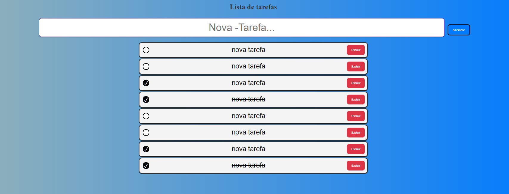

# Lista de Tarefas Interativa

Este é um aplicativo de lista de tarefas interativa criado com HTML, CSS e JavaScript.

# 
   - 

## Funcionalidades

- Adicionar novas tarefas
- Marcar tarefas como concluídas
- Excluir tarefas

## Como Usar

1. Faça um clone deste repositório.
2. Abra o arquivo `index.html` no seu navegador.

## Como Adicionar uma Tarefa

Você pode adicionar uma nova tarefa de duas maneiras:

- Digite o nome da tarefa no campo de entrada e clique no botão "Adicionar".
- Pressione a tecla "Enter" após digitar o nome da tarefa.

## Licença

Este projeto está licenciado sob a [Licença MIT](LICENSE).